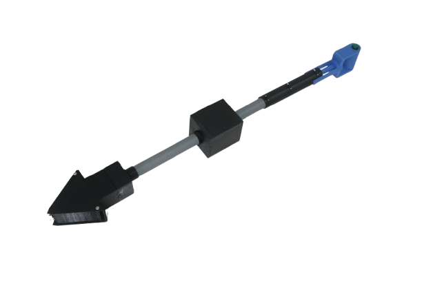

# SAKTI: Sistem Analisis Kelapa sawit Terintegrasi IoT

---

## Deskripsi Sistem Terintegrasi
Proyek **SAKTI** adalah Sistem Embedded dan Internet of Things (IoT) berskala penuh yang dirancang untuk melakukan deteksi dini terhadap serangan jamur patogen mematikan *Ganoderma boninense* (penyebab penyakit Busuk Pangkal Batang/BPB) pada perkebunan kelapa sawit. 

Pendekatan reaktif yang mengandalkan inspeksi visual seringkali terlambat karena infeksi internal sudah parah saat gejala fisik muncul. Oleh karena itu, sistem SAKTI mengkorelasikan dua sumber data utama:
1. **Pemindaian Udara (Computer Vision):** Menggunakan Drone DJI Mini 4 Pro untuk pemetaan georeferensial dan identifikasi awal gejala stres pada daun (pucuk menguning) dari atas.
2. **Pemindaian Tanah (IoT Datalogger):** Menggunakan instrumen fisik portabel berupa **"Tongkat SAKTI"** berbasis mikrokontroler ESP32 untuk memvalidasi kondisi lingkungan tanah di titik koordinat yang dicurigai.

---

## Arsitektur dan Alur Kerja Sistem
Sistem SAKTI mengimplementasikan arsitektur *edge-to-cloud* yang terdiri dari tiga komponen komputasi utama:

### 1. Akuisisi Citra Udara (Drone & YOLOv8L)
- **Pemetaan Udara:** Drone otonom melakukan pemetaan (*mapping*) area perkebunan. Resolusi spasial tinggi (GSD 4 cm/piksel) digunakan untuk menjamin ketajaman visualisasi daun.
- **Deteksi & Klasifikasi:** Citra disatukan menjadi *orthomosaic*. Model **YOLOv8L** (You Only Look Once) digunakan untuk dua tahap deteksi:
  - Mengidentifikasi, menghitung populasi, dan memberikan ID unik pada setiap pohon kelapa sawit (mAP50: 95.7%).
  - Mengklasifikasikan daun yang menguning akibat gejala penyakit BPB.
- **Georeferencing:** Proses pemberian referensi geografi sehingga setiap pohon yang terdeteksi sakit akan ditandai dalam peta digital.

### 2. Akuisisi Data Tanah (Tongkat SAKTI)
Titik-titik pohon yang terindikasi sakit di peta akan dikunjungi oleh petugas lapangan untuk diinspeksi tanahnya menggunakan **Tongkat SAKTI**.
- **Sensor:** Merekam suhu tanah (MAX6675), kelembaban (Analog), dan tingkat keasaman/pH (ADS1115 16-bit ADC) secara presisi.
- **Lokasi & Waktu:** Dilengkapi GPS dan RTC (DS3231) untuk memastikan setiap sampel pengukuran memiliki koordinat lintang/bujur dan *timestamp* yang valid.
- **Mode Operasional:**
  - **Offline:** Di area perkebunan *blank spot*, data disimpan secara lokal pada modul Micro SD Card berformat `log.csv`.
  - **Online:** Ketika perangkat terhubung dengan jaringan internet via *WiFiManager*, data akan disinkronisasi (*batch upload*) melalui protokol **MQTT** (Broker NanoMQ) ke server pusat.

### 3. Analisis Machine Learning dan Aplikasi Web (PWA)
- **Model Random Forest:** Data CSV dari Tongkat SAKTI dikirim ke *cloud* dan diproses oleh algoritma *Random Forest Classifier* untuk mengklasifikasikan risiko kemunculan jamur Ganoderma berdasarkan kondisi asam/suhu/kelembaban tanah. Korelasi antara data visual daun (Drone) dan data tanah aktual (IoT) memberikan konfirmasi diagnostik akhir.
- **Progressive Web App (PWA):** Hasil analisis disajikan melalui antarmuka *dashboard* berbasis PWA yang modern. 
  - Mendukung fungsionalitas *offline-first* dengan *Service Worker* (Caching aset dan API jaringan lokal).
  - Menampilkan visualisasi peta lahan (GeoTIFF) terintegrasi dengan zona risiko (*overlay* titik pohon sehat dan sakit).
  - Menyediakan manajemen perangkat IoT jarak jauh (*Online/Offline status*, *Last update*).

---

## Spesifikasi Perangkat Keras (Tongkat SAKTI)
Struktur tongkat dirancang ergonomis dengan ujung *stainless steel* runcing untuk penetrasi tanah, serta dilengkapi mekanisme per (*spring damper*) untuk meredam kejut mekanis saat ditancapkan ke tanah keras.

  

**Komponen Elektronik:**
- Mikrokontroler: **ESP32** (Wi-Fi Enabled)
- Penyimpanan & Waktu: Modul SD Card (SPI), RTC DS3231 (I2C)
- Navigasi: Modul GPS (UART)
- Sensor Suhu: **MAX6675** (Thermocouple)
- Sensor Kelembaban: Analog Soil Moisture Sensor
- Sensor pH Tanah: Analog pH Sensor + Modul **ADS1115** (ADC)
- Indikator: Buzzer Auditori & LED Baterai/Status Jaringan

## Dependensi Perangkat Lunak (Embedded System)
Untuk melakukan kompilasi kode sumber (*firmware*) ESP32 pada *Arduino IDE*, pustaka (*library*) berikut harus diinstal:
- `MAX6675.h`
- `SD.h`, `SPI.h`, `Wire.h`
- `RTClib` (oleh Adafruit)
- `TinyGPSPlus`
- `PubSubClient` (Klien MQTT)
- `Adafruit_ADS1X15`
- `WiFiManager`

## Panduan Pengoperasian Alat (Datalogger)
1. **Inisialisasi Sistem**: Hidupkan perangkat. ESP32 akan melakukan inisialisasi modul dan mencoba menyambung ke jaringan Wi-Fi tersimpan. Jika gagal, indikator LED Wi-Fi akan padam dan sistem masuk ke Mode Offline secara otomatis.
2. **Akuisisi Data Lapangan (Pin 27)**: Tekan tombol **Log**. Sistem akan membaca nilai dari seluruh sensor, mencatat koordinat GPS, serta stempel waktu, dan menyimpannya (append) ke dalam file `log.csv` pada SD Card. Modul Buzzer akan memberikan *feedback* audio satu kali.
3. **Sinkronisasi Server (Pin 26)**: Saat berada di area dengan jangkauan internet, tekan tombol **Kirim**. ESP32 akan memproses seluruh isi `log.csv` dan mengunggahnya baris demi baris via MQTT. Jika transmisi berhasil diselesaikan (100%), *log file* pada SD Card akan dikosongkan dan Buzzer akan membunyikan melodi sinkronisasi komplit.

---
*Dokumentasi disusun berdasarkan Laporan Proyek Telematika (2025).*
